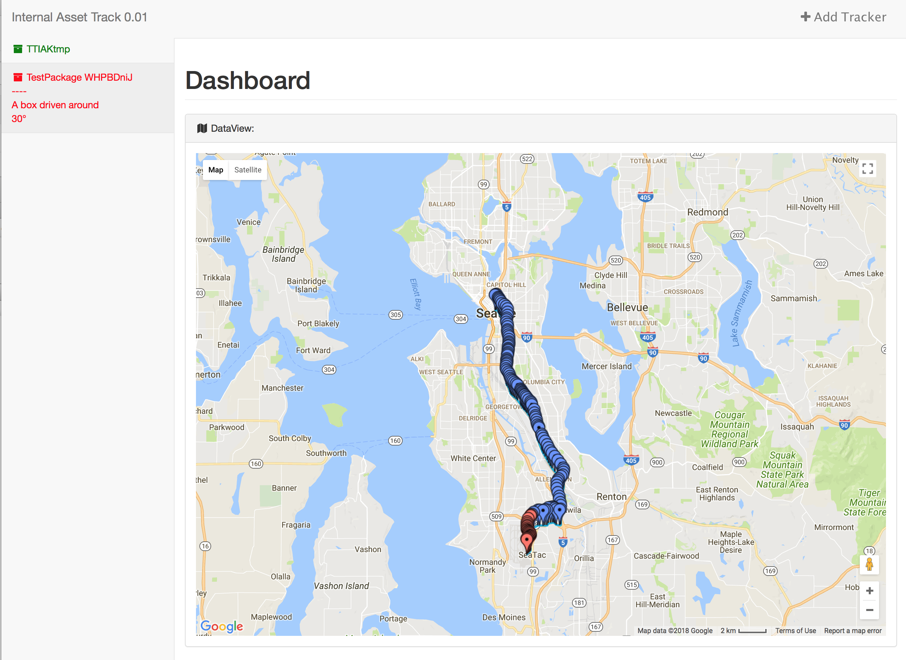
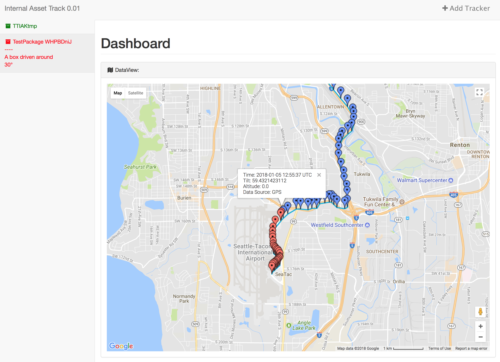

# gpsAssetTracker

gpsAssetTracker is a Server and GPS tracking device software written in Python

# Screenshot

# Overview

Raspberry Pi --> Hologram.io Data Engine <--> Python Flask

# Device

The hardware device is a Raspberry Pi Zero W, Hologram Nova 3G/2G Global Cellular Modem, NEO-6M GPS Module and MPU-6050 6-axis Gyro Acc.

# Dependencies

## Raspberry Pi:

* [Hologram Python SDK](https://hologram.io/docs/reference/cloud/python-sdk/)

sudo apt-get install 

* python-smbus
* python-gps
* gpsd
* gpsd-clients
* libgps-dev

pip install

* [mpu6050-raspberrypi](https://pypi.python.org/pypi/mpu6050-raspberrypi/) (and it's dependencies)

## Server

pip install

* [flask](http://flask.pocoo.org)
* [flask-googlemaps](https://github.com/rochacbruno/Flask-GoogleMaps)

# Running the Server

    sudo python gateway.py

Should be running on port 80. Must be public facing for Hologram Data Router to POST data to. It is possible to use [cloudflare-warp](https://warp.cloudflare.com) to tunnel your local server to the internet.

# Running the Device

    sudo /path/to/senseStart.sh
    sudo python positioning.py

